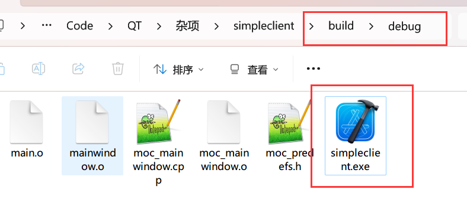
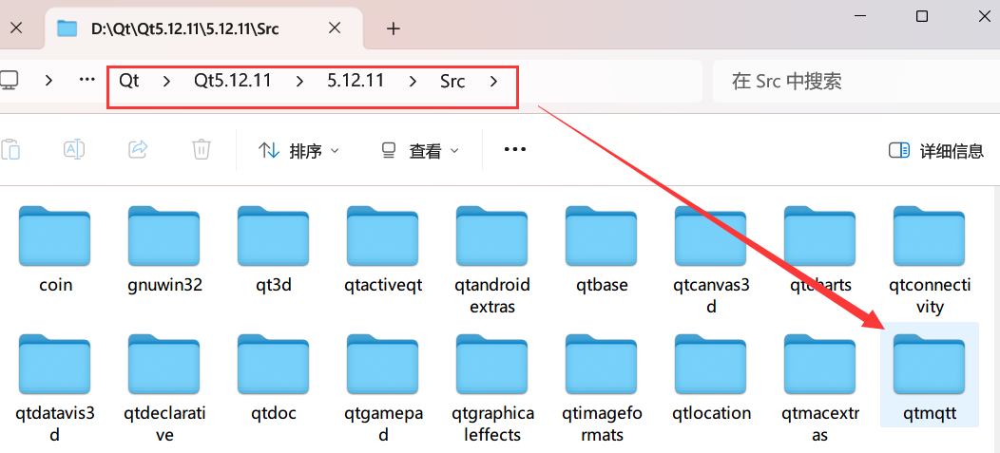
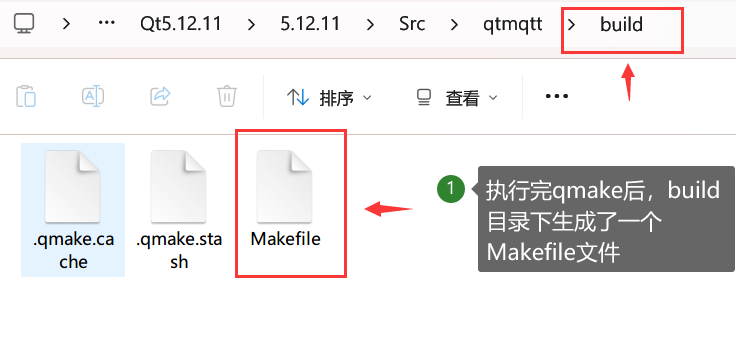
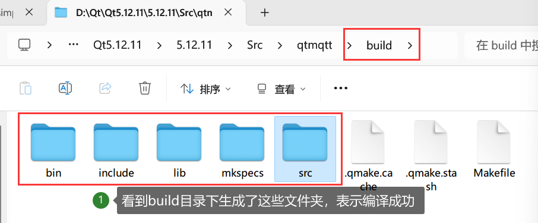
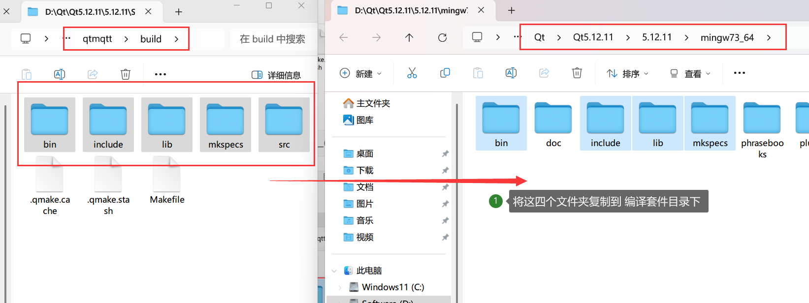

# QT客户端通过MQTT与华为云通信
#### **1.环境：**

- 运行平台：
  - Windows (x86\x64)
  - Linux (x86\x64\arm64\arm32)
- 开发板：野火的iMX6ULL（可选）
- 通信协议：MQTT
- 编译套件：Qmake by Qt5.12.xx （理论是Qt5版本的编译套件即可）
- 其它：QtMQTT moudle（Qt5.9以后不在自带MQTT模块，需自行编译）

---

#### **2.实现功能：**

- 将设备数据(随机数)发送至华为云平台
- 华为云平台下发指令控制开发板外设

---

#### 3.编译&运行（该方式为命令，使用QtCreator者请直接双击xxx.pro文件）

1. 克隆项目到本地

2. 进入工程的 **build** 目录

   ```shell
   cd ./build
   ```

3. Qmake生成Makefile（自行选择编译套件Kit，我这里是Windows用5.12.11/MinGW730_64/bin/qmake）

   ```shell
   qmake ..\simpleclient.pro
   ```

4. 编译Makefile

   - Windows

     ```shell
     mingw32-make debug
     ```

   - Linux

     ```shell
     make debug
     ```

     注：编译遇到问题请移步至 

5.  运行程序

   进入build\debug，找到.exe文件运行即可
   
   

---

#### 4.功能演示

- 数据上报

  - 结果：

    1. 用户配置连接信息后，点击`连接`按钮连接至华为云平台。

    2. 接着用户点击发布按钮后，程序将Message文本框的内容发送至华为云平台

  - 配置项说明：
    - Host（目标主机）：MQTT服务器的IP:PORT，这里填华为云提供的信息
    - ClientID（客户端ID）：华为云平台提供
    - UserName（用户名）：华为云平台提供
    - Password（密码）：华为云平台提供
    - Topic（接收消息的主题）：华为云平台提供
    - Message（消息内容，注：MQTT中的消息指发送的内容即payload）：华为云平台提供

  


- 指令下发

  - 结果：
    1. 用户在云平台下发指令
    2. 用户在客户端程序接收到指令内容

  

- 设备端控制LED

  - 结果：设备自己控制LED灯

  

- 云端控制LED

  - 结果：云平台远程控制LED
  
  


----

**补充：**

问题1：如果编译的时候提示找不到命令的情况？那说明没有配置环境变量，这个时候可以使用绝对路径


问题2：提示没有mqtt模块？Qt5.9以后Qt不再自带MQTT模块。问题不大，自行下载QTMQTT源码进行编译

- 下载QT的MQTT源码

  - 地址：[qt/qtmqtt at 5.12.11 (github.com)](https://github.com/qt/qtmqtt/tree/5.12.11)

  - 克隆到本地(没有配置git命令的伙伴可以下载zip压缩包)： `-b` 参数 表示要克隆的分支，后面跟着自己编译套件的版本号（自行修改）

    ```shell
    git clone -b 5.12.11 git@github.com:qt/qtmqtt.git
    ```

- 复制QTMQTT源码

  以我的为例，我的Qt安装在D盘，将`qtmqtt`文件夹复制到`D:\Qt\Qt5.12.11\5.12.11\Src`

  

- 编译源码

  1. 进入qtmqtt目录

  2. 创建build文件夹

  3. 在build目录下打开终端(以下命令均在build文件夹下执行)

  4. 执行Qmake生成Makefile文件

     ```shell
     D:\Qt\Qt5.12.11\5.12.11\mingw73_64\bin\qmake ..\qtmqtt.pro
     ```

     `我这里的qmake使用的绝对路径，自行修改路径`

     - 命令执行结果：
     
     
     
  5. 编译

     ```shell
     D:\Qt\Qt5.12.11\Tools\mingw730_64\bin\mingw32-make.exe debug
     ```
     
     `我这里的mingw32-make使用的绝对路径，自行修改路径`
     
     - 命令执行结果：
     
      
     
     
     
  6. 复制生成文件至编译套件下（注意用哪个编译套件编译的，就复制到哪个编译套件）
  
     
  
